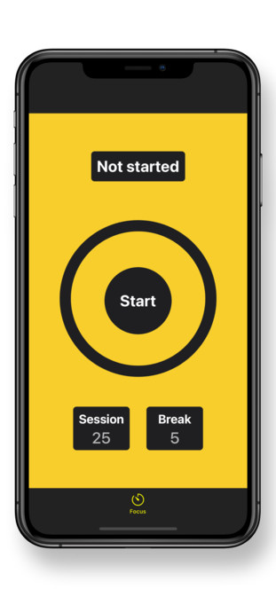
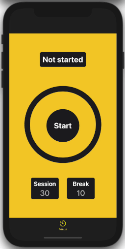

# Windows

Windows is a pomodoro-like app written in Swift. 

# Screenshots

 
   
 

# How to use

  - Tap start button to start or pause timer
  - Tap session/break to change duration
  - Long-press on start button to reset timer

# Installation

Clone the repository, open Windows.xcodeproj file and run on simulator.

